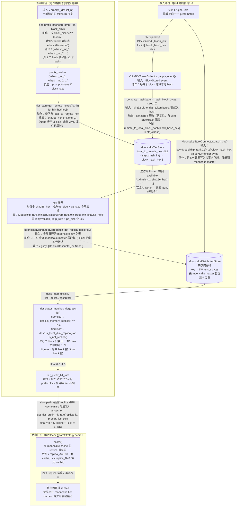

# Design: MooncakeTierCollector in uni-agent llm_router

## Context

uni-agent 的 `get_tier_prefix_hit_rate()` 目前是占位符，返回 None。
目标：实现该方法，通过 mooncake store 的 `batch_get_replica_desc` 接口，
区分 block 副本的存储介质（MEMORY / LOCAL_DISK / DISK），
填充 KVCacheAwareStrategy 的 slow-path tier 打分，
让路由器能感知 SSD offload 状态。

调用链全程同步（Ray actor，无 asyncio），`batch_get_replica_desc` 在调用时同步发起，
延迟可接受（本地网络 RPC）。

实验约束：启动 vllm 时需设置 `VLLM_KV_EVENTS_USE_INT_BLOCK_HASHES=0`，
确保 KV event 发送完整 32-byte BlockHash（bytes），而非截断的 64-bit int（默认=1）。

## 架构

```
vllm ZMQ KV events (VLLM_KV_EVENTS_USE_INT_BLOCK_HASHES=0)
    ↓
VLLMKVEventCollector._apply_event()  [改动最小]
    ├─ 原有逻辑：local xxhash → KVCacheStore.replicas_by_block
    └─ 新增：若 tier_store 注册，同步写
             local_hash_str → block_hash_hex 到 MooncakeTierStore.local_to_remote_hex
             （BlockRemoved 时同步清理）

RouteDataProvider.get_tier_prefix_hit_rate(node_id, prompt_ids, tier)
    └─ tier="cpu" 或 "ssd" →
         1. get_prefix_hashes(prompt_ids, block_size) → local hash list
         2. local_to_remote_hex 查出 block_hash_hex list（缺失则跳过）
         3. 枚举 tp_rank × pp_rank 构造所有 mooncake key
            格式: [cache_prefix@]model_name@tp_rank:X@pcp0@dcp0@pp_rank:W@group:0
         4. mooncake_store.batch_get_replica_desc(keys) [同步调用]
         5. 解析 descriptor → 按 tier 统计命中：
              tier="cpu" → 统计 MEMORY replica 比例
              tier="ssd" → 统计 LOCAL_DISK 或 NOF_SSD replica 比例
         6. 返回 0.0~1.0（无 local_to_remote_hex 记录则返回 None）
```

## 关键设计决策

### Key 构造（与 vllm worker.py:1017-1028 完全一致）
- `model_name` = `config.model_name`（用户配置，等于 model_path 最后一段）
- `pcp_rank=0, dcp_rank=0, group_id=0`（硬编码，verl 不暴露这些）
- 枚举 `tp_rank in range(tp_size)` × `pp_rank in range(pp_size)`
- 对每个 block_hash_hex 构造 `tp_size × pp_size` 个 key，取任意有效 descriptor

### Descriptor → Tier 映射
```
is_memory_replica()     → "cpu"（DRAM，对应 kvc_aware layer_weights["cpu"]=1.0）
is_local_disk_replica() → "ssd"（本地 SSD，对应 layer_weights["ssd"]=0.25）
is_nof_replica()        → "ssd"（NVMe-oF，也归入 ssd tier）
is_disk_replica()       → 忽略（远端慢存储，不在 vllm tier 体系里）
```
命中率 = 匹配 tier 的 block 数 / 总 block 数（prefix chain 长度）

### KVCacheEvent 改动（方案 B，不动现有字段）
`KVCacheEvent` 加字段：
```python
block_hashes_hex: list[str] | None  # bytes.hex()，int 模式下为 None
```
`_build_block_stored` 新增：
```python
raw = fields[0]
hexes = [bh.hex() if isinstance(bh, bytes) else None for bh in raw]
block_hashes_hex = hexes if all(h is not None for h in hexes) else None
```
原有 `block_hashes = [str(bh) for bh in fields[0]]` 不动。

### VLLMKVEventCollector 与 MooncakeTierStore 耦合
- `VLLMKVEventCollector` 加 `tier_store: Optional[MooncakeTierStore] = None`
- `RouteDataProvider.__init__` 同时注册 `"vllm_zmq"` + `"mooncake_tier"` 时，
  将 MooncakeTierStore 注入到 VLLMKVEventCollector

## 需新增/修改的文件

### 新增
- `uni_agent/llm_router/collectors/store/mooncake_tier_store.py`
  — `MooncakeTierStore`
  — `local_to_remote_hex: dict[str, str]`（local_hash_str → block_hash_hex）
  — thread-safe（读写发生在不同线程：ZMQ 线程写，Ray actor 线程读）

- `uni_agent/llm_router/config/mooncake_config.py`
  — `MooncakeCollectorConfig` dataclass：
    `model_name: str`, `tp_size: int = 1`, `pp_size: int = 1`, `cache_prefix: str = ""`,
    `metadata_server: str`, `local_hostname: str = "localhost"`,
    `global_segment_size: int`, `local_buffer_size: int`,
    `protocol: str = "tcp"`, `device_name: str = ""`, `master_server_address: str`

### 修改
- `uni_agent/llm_router/collectors/collector/vllm/kv_event.py`
  — `KVCacheEvent` dataclass 加 `block_hashes_hex: list[str] | None = None`
  — `_build_block_stored` 填充该字段

- `uni_agent/llm_router/collectors/collector/vllm/event_collector.py`
  — 加 `tier_store: Optional[MooncakeTierStore] = None`
  — `_apply_event` BlockStored：若 `event.block_hashes_hex` 非 None 且 tier_store 注册，
    写 `local_hash_str → block_hash_hex` 到 `tier_store.local_to_remote_hex`
  — `_apply_event` BlockRemoved：清理对应 local_hash_str 的 remote_hex 映射
  — `_apply_event` AllBlocksCleared：清空整个 replica 的映射

- `uni_agent/llm_router/collectors/registry.py`
  — 注册 `"mooncake_tier"` → collector stub + store=`MooncakeTierStore`

- `uni_agent/llm_router/collectors/provider.py`
  — `__init__`：检测 `"mooncake_tier"` 在 collection_names 时，
    将 MooncakeTierStore 注入 VLLMKVEventCollector；
    初始化 `MooncakeDistributedStore` 并 setup（连接 mooncake master）
  — `get_tier_prefix_hit_rate()` 实现（见架构图）

- `uni_agent/llm_router/configs/kvc_aware_router.yaml`
  — 增加 mooncake 配置块示例

## Router YAML 配置（用户侧）

```yaml
collector:
  mooncake:
    model_name: "Qwen2.5-7B-Instruct"
    tp_size: 1
    pp_size: 1
    cache_prefix: ""
    metadata_server: "P2PHANDSHAKE"
    local_hostname: "localhost"
    global_segment_size: 67108864
    local_buffer_size: 134217728
    protocol: "tcp"
    device_name: ""
    master_server_address: "127.0.0.1:50051"
collection_names:
  - vllm_zmq
  - mooncake_tier
```

## 环境变量要求

```bash
VLLM_KV_EVENTS_USE_INT_BLOCK_HASHES=0
```

## 验证方案

1. 启动 mooncake_master + vllm（KV events 开启 + `VLLM_KV_EVENTS_USE_INT_BLOCK_HASHES=0`）
2. 发推理请求触发 KV block 写入，等待 SSD offload
3. 检查 `MooncakeTierStore.local_to_remote_hex` 非空
4. 调用 `get_tier_prefix_hit_rate(replica_id, prompt_ids, "ssd")`，验证非 None
5. 单测：mock `batch_get_replica_desc` 返回各种 descriptor，断言命中率计算正确

## 数据流图




### ReplicaDescriptor 字段说明

| 字段 | 含义 |
|------|------|
| `is_memory_replica()` | block 在 DRAM（cpu tier） |
| `is_local_disk_replica()` | block 在本地 SSD（ssd tier） |
| `is_disk_replica()` | block 在远端磁盘（忽略） |
| `status` | `ReplicaStatus.COMPLETE` 表示可用 |
| `get_memory_descriptor().buffer_descriptor.transport_endpoint` | 副本所在节点地址（区分 local/remote） |

### 验证结果（vllm 0.22.0 + MooncakeStoreConnector）

- `batch_get_replica_desc` 返回 `is_memory_replica=True, status=COMPLETE`
- `transport_endpoint: 'localhost:...'`（本机）vs `'172.17.0.3:...'`（跨进程）均可区分
- `get_tier_prefix_hit_rate(tier='cpu')` 返回非 None（如 `0.73`）
- 路由器正确把 slow path 请求打高分路由到有 mooncake cache 的 replica（0.80 vs 0.06）

